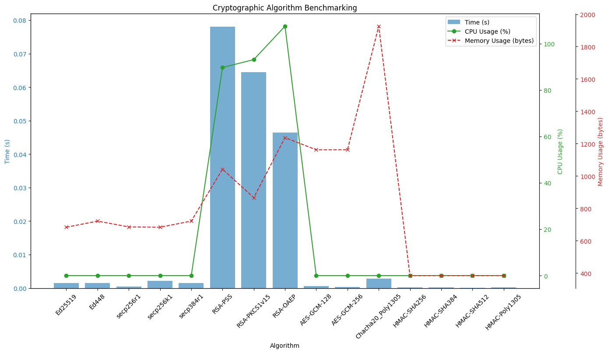

# Cryptographic Algorithm Benchmarking

This project benchmarks the performance of various cryptographic algorithms, measuring their execution time, CPU usage, and memory usage. The results are visualized in a plot to aid in comparing the algorithms.

## Algorithms Benchmarked

### Elliptic Curve Cryptography (EC)
- Ed25519
- Ed448
- secp256r1 (P-256)
- secp256k1
- secp384r1 (P-384)

### RSA
- RSA-PSS
- RSA-OAEP
- RSA-PKCS1v15

### Symmetric Encryption
- AES-GCM-128
- AES-GCM-256
- ChaCha20-Poly1305

### Hash-Based Message Authentication Code (HMAC)
- HMAC-SHA256
- HMAC-SHA384
- HMAC-SHA512
- HMAC-Poly1305

## Benchmark Metrics

1. **Time (s):** Total execution time for the algorithm.
2. **CPU Usage (%):** CPU resources utilized during execution.
3. **Memory Usage (bytes):** Peak memory usage during execution.

## Plot Overview

The benchmark results are visualized using a multi-axis plot:
- **Bar Graph:** Represents execution time.
- **Line Graph (Green):** CPU usage.
- **Line Graph (Red):** Memory usage.

Below is a sample plot generated by the benchmarking tool:



## Requirements

- Python 3.7+
- Libraries:
  - `cryptography`
  - `psutil`
  - `matplotlib`

## How to Run

1. Install dependencies:
   ```bash
   pip install cryptography psutil matplotlib pycryptodome

