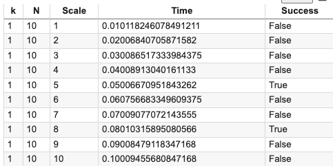
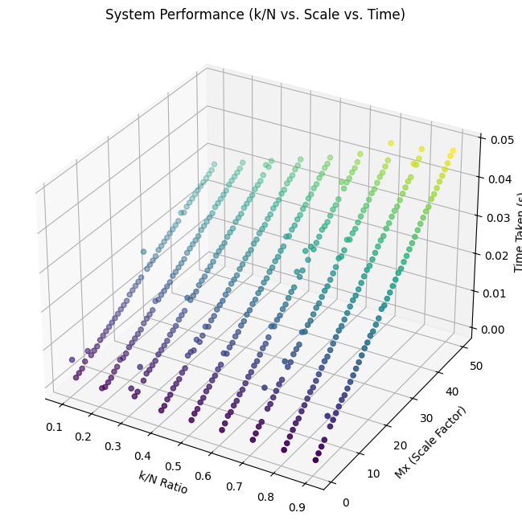

To create a methodological test bench for a system using 𝑘 of 𝑁 systems, to evaluate performance across 2 axes: 
1. Fractional Consideration: Varying the 𝑘/𝑁  ratio (e.g., 10%, 20%, 30%, etc.) 
2. Scale Factor: Increasing the workload or system size from 1× to 50×

## 1. Designing the Test Bench Strategy
A systematic test bench should:
Isolate Variables: Control one axis while sweeping through the other.
Automate Tests: Run all combinations of 𝑘/𝑁 and scale factors.
Collect Metrics: Measure and log key performance indicators (e.g., latency, throughput, success rate).
Ensure Repeatability: Use fixed seeds for randomness (if applicable).
Analyze Trends: Identify patterns, bottlenecks, and thresholds.

## 2. Test Plan Structure
2.1. Input Parameters:
𝑁 – Total systems
𝑘 – Active systems
Scale Factor – System load or capacity multiplier

2.2. Output Metrics:
Execution time
Failure rate
Resource usage (CPU, memory, I/O)
System resilience (recovery time)

2.3. Iteration Plan:
Loop over all desired 𝑘/𝑁 values.
For each 𝑘/𝑁, loop through scale factors from 1× to 50×.

Collect and store results systematically.

## 3. To generate a 3D plot
It benchmarks the system by varying:
X-axis: 𝑘/𝑁 ratio
Y-axis: Scale factor (increasing both 𝑘 and 𝑁 proportionally)
Z-axis: Time taken for the system to process

