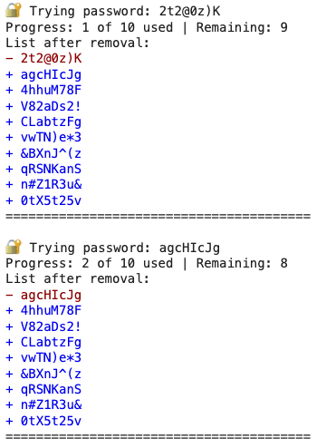
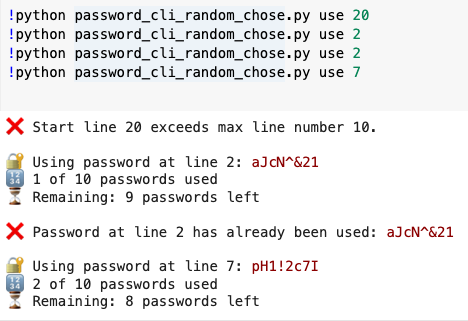

1. Stores passwords in a file

```
🧪 Setup: Passwords File
Create a file named passwords.txt manually or with a generator (passcode_generator_and_usage_attrition.py):

echo -e "pass1\npass2\npass3\n..." > passwords.txt
```

2. Tracks used passwords in a separate inventory
3. Allows resuming across runs (you can quit and come back)

Displays:
- 🔢 k of N passwords used (passwords.txt)
- ⏳ Remaining: N - k passwords left (used_passwords.txt)
- Always uses & removes from the top of the list.

| Command                        | Description                     |
| ------------------------------ | ------------------------------- |
| `python password_cli.py use`   | Use and remove the top password |
| `python password_cli.py show`  | Show used passwords inventory   |
| `python password_cli.py reset` | Reset inventory (used list)     |


# Random Select and Exclude Version

- Starts at line LINE_NUMBER (1-based indexing).
- Will error out if:
	- The password at that line has already been used
	- The line number is invalid (less than 1 or exceeds file length)

```bash
python password_cli_random_chose.py use [LINE_NUMBER]

python password_cli_random_chose.py reset
```

✅ Behavior
- Passwords are never removed from passwords.txt
- Each password can only be used once
- Clear progress messages are shown
- Errors are printed if a password is reused

