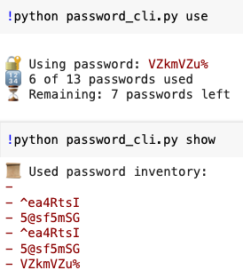

1. Stores passwords in a file

```
🧪 Setup: Passwords File
Create a file named passwords.txt manually or with a generator (passcode_generator_and_usage_attrition.py):

echo -e "pass1\npass2\npass3\n..." > passwords.txt
```

2. Tracks used passwords in a separate inventory
3. Allows resuming across runs (you can quit and come back)

Displays:
- 🔢 k of N passwords used (passwords.txt)
- ⏳ Remaining: N - k passwords left (used_passwords.txt)
- Always uses & removes from the top of the list.

| Command                        | Description                     |
| ------------------------------ | ------------------------------- |
| `python password_cli.py use`   | Use and remove the top password |
| `python password_cli.py show`  | Show used passwords inventory   |
| `python password_cli.py reset` | Reset inventory (used list)     |

